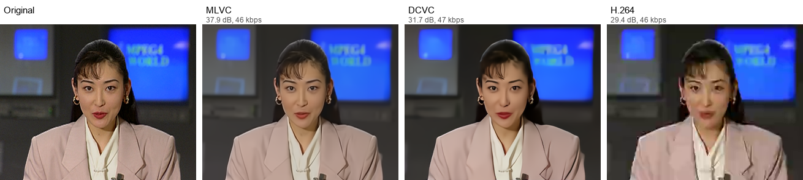
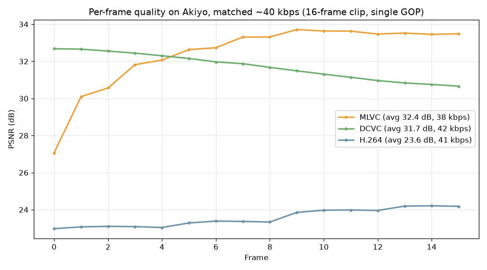

# Faces at 42 kbps

A small experiment comparing neural video codecs (DCVC and MLVC) against standard
H.264 at matched, ultra-low bitrates, to see which one keeps a talking-head video
watchable when bandwidth is very limited. This repo has the code, data, and exact
steps to reproduce it yourself.

No GPU required. Everything below runs on CPU. It's slow but correct.

## Result

At roughly 40 kbps, bad-connection territory, on the same clip at the same file
size:

| Codec | Bitrate | PSNR |
|---|---|---|
| H.264 | 41 kbps | 23.6 dB |
| DCVC (2021) | 42 kbps | 31.7 dB |
| MLVC (2026) | 38 kbps | 32.4 dB |



A single still frame isn't actually enough to judge a video codec fairly: every
frame here is predicted from the one before it, so quality drifts across a clip in
a way one frame can hide. Here's the same 16-frame clip playing, and quality
plotted frame by frame instead of just eyeballed at one point in time:

<video src="videos/akiyo_comparison.mp4" controls width="600"></video>



One honest nuance the still frame hides: MLVC actually starts *behind* DCVC on the
very first frame (27.1 dB vs 32.7 dB), since that frame is intra-coded and DCVC's
keyframe compressor happens to be stronger here. MLVC overtakes by frame 5 and
stays ahead for the rest of the clip, so its advantage comes from stronger
frame-to-frame prediction, not better keyframes. Raw per-frame data for all three
codecs is in [`results/`](results) (`akiyo_mlvc_per_frame_results.json`,
`akiyo_dcvc_per_frame.json`, `akiyo_h264_per_frame.json`).

MLVC is a newer codec from the same research lineage as DCVC, built specifically to
be deployable on real hardware (phone NPUs, CPUs) instead of just a research GPU.
Averaged across the clip it edges out DCVC while using less bitrate, and both
leave H.264 far behind. See [MLVC](#mlvc-a-newer-production-oriented-codec) below
for how to run it yourself.

The DCVC vs H.264 gap holds under real motion too, tested separately on a clip
with actual head turns and camera movement:


Full numbers across four bitrates are in [Results we got](#results-we-got-for-reference)
below, and the raw JSON output from every run is in [`results/`](results).

## 0. Prerequisites

- Python 3.10 to 3.12
- `ffmpeg` with `libx264` support (the [gyan.dev](https://www.gyan.dev/ffmpeg/builds/) Windows builds work fine)
- ~500MB disk space for model checkpoints
- No CUDA/GPU needed for this path (the newer "DCVC-RT" variant does need one, see the note at the bottom)

## 1. Get the code

```bash
git clone --depth 1 https://github.com/microsoft/DCVC.git
cd DCVC/DCVC-family/DCVC
```

Everything else below happens inside this `DCVC/DCVC-family/DCVC` directory unless noted.

## 2. Install dependencies

```bash
pip install torch torchvision --index-url https://download.pytorch.org/whl/cpu
pip install -r requirements.txt
```

Note: `torchvision` is not listed in `requirements.txt` but is imported by the code.
Install it explicitly or you'll hit `ModuleNotFoundError: No module named 'torchvision'`.

## 3. Download the pretrained models

Two separate sets of checkpoints are needed: an "I-frame" (keyframe) image compressor,
and the actual DCVC video model.

**I-frame models** (public, direct download, scripted):
```bash
cd checkpoints
python download_compressai_models.py
cd ..
```
This pulls 8 files (`cheng2020-anchor-*.pth.tar`, `bmshj2018-hyperprior-*.pth.tar`) from
a public S3 bucket, ~380MB total.

**DCVC video models** (manual, this is the one annoying step):
The video-model weights live in a Microsoft OneDrive folder linked from the repo's
README, and OneDrive's share links only render through a real browser (`curl`/`wget`
just get redirected into an unusable SharePoint page, HTTP 403). Open the link in a
browser, select the 4 files named `model_dcvc_quality_0_psnr.pth` through
`model_dcvc_quality_3_psnr.pth` (~37MB each), download, and place them in `checkpoints/`.
There are also `_msssim.pth` variants, not needed for this test, which uses the PSNR
objective throughout.

You should end up with these in `checkpoints/`:
```
cheng2020-anchor-3-e49be189.pth.tar   cheng2020-anchor-4-98b0b468.pth.tar
cheng2020-anchor-5-23852949.pth.tar   cheng2020-anchor-6-4c052b1a.pth.tar
bmshj2018-hyperprior-ms-ssim-*.pth.tar (x4, unused here but downloaded by the script)
model_dcvc_quality_0_psnr.pth ... model_dcvc_quality_3_psnr.pth
```

Quality preset to matching I-frame checkpoint:

| DCVC quality | I-frame checkpoint |
|---|---|
| 0 | `cheng2020-anchor-3-e49be189.pth.tar` |
| 1 | `cheng2020-anchor-4-98b0b468.pth.tar` |
| 2 | `cheng2020-anchor-5-23852949.pth.tar` |
| 3 | `cheng2020-anchor-6-4c052b1a.pth.tar` |

## 4. Get test footage

We used two classic, public-domain CIF (352x288) test sequences from Xiph.org's derf
collection, standard in video-compression research since the 1990s:

```bash
curl -o akiyo_cif.y4m   https://media.xiph.org/video/derf/y4m/akiyo_cif.y4m
curl -o foreman_cif.y4m https://media.xiph.org/video/derf/y4m/foreman_cif.y4m
```

DCVC requires frame dimensions to be a multiple of 64, so crop 352x288 down to
320x256 and extract 16 frames as PNGs (place these *outside* the DCVC repo, e.g. a
sibling `testdata/` folder):

```bash
mkdir -p testdata/akiyo_320x256/akiyo_320x256
ffmpeg -i akiyo_cif.y4m -vframes 16 -vf "crop=320:256:16:16" \
  testdata/akiyo_320x256/akiyo_320x256/im%05d.png

mkdir -p testdata/foreman_320x256/foreman_320x256
ffmpeg -i foreman_cif.y4m -vframes 16 -vf "crop=320:256:16:16" \
  testdata/foreman_320x256/foreman_320x256/im%05d.png
```

## 5. Write the dataset config

DCVC's test script wants a JSON manifest. Save as `poc_dataset_config.json` inside the
`DCVC/DCVC-family/DCVC` directory (adjust `base_path` to wherever your `testdata` folder
actually is, relative to that directory). A copy of the exact configs used here is in
[`results/`](results).

```json
{
    "AkiyoPOC": {
        "base_path": "../../../testdata/akiyo_320x256",
        "sequences": {
            "akiyo_320x256": {"frames": 16, "gop": 16}
        }
    }
}
```

Make a second one, `poc_dataset_config_foreman.json`, pointing at `foreman_320x256`
the same way.

## 6. Run DCVC (once per quality preset)

```bash
python test_video.py \
  --i_frame_model_name cheng2020-anchor \
  --i_frame_model_path checkpoints/cheng2020-anchor-3-e49be189.pth.tar \
  --test_config poc_dataset_config.json \
  --cuda false --worker 1 \
  --output_json_result_path poc_result_q0.json \
  --model_type psnr \
  --recon_bin_path poc_recon_q0 \
  --write_recon_frame true --write_stream false \
  --model_path checkpoints/model_dcvc_quality_0_psnr.pth
```

Repeat for quality 1, 2, 3. Swap the `--i_frame_model_path` and `--model_path` per the
table above, and change the output/recon folder names so they don't overwrite each
other (`poc_result_q1.json`, `poc_recon_q1`, etc.).

`--write_stream false` skips writing an actual compressed bitstream to disk (which
needs a compiled C++ extension you'd otherwise have to build) and instead reports the
*entropy-estimated* bits-per-pixel, the standard way these models are evaluated in
research, and what the numbers below are built from. `--write_recon_frame true` saves
the actual rebuilt PNG frames so you can look at them, at
`poc_recon_q0/akiyo_320x256/model_dcvc_quality_0_psnr/recon_frame_*.png`.

Each run takes roughly 90 seconds on a laptop CPU for 16 frames. Read the resulting
`poc_result_q*.json`. The field you want is `ave_all_frame_bpp` (bits per pixel) and
`ave_all_frame_quality` (PSNR in dB).

To convert bpp to kbps for a given resolution/framerate:
```
kbps = bpp * width * height * fps / 1000
```
(320 x 256 x 29.97fps, in our case.)

Run the same command against `poc_dataset_config_foreman.json` (with `quality 0`) to
get the motion-clip comparison point.

## 7. Build the matched H.264 baseline

For each DCVC result, encode the same PNG frames with H.264 at the same bitrate DCVC
used (take the kbps number from step 6):

```bash
ffmpeg -framerate 29.97 -i testdata/akiyo_320x256/akiyo_320x256/im%05d.png \
  -c:v libx264 -x264-params "nal-hrd=cbr" \
  -b:v 42k -minrate 42k -maxrate 42k -bufsize 10k -g 16 -pix_fmt yuv420p \
  akiyo_h264_42k.mp4
```

Check ffmpeg's own log line `kb/s: ...` to see the actual achieved bitrate. It won't
match your target exactly, use the real one for a fair comparison. Also note this is
the encoder's own bitrate for the picture data only. Don't use `ffprobe`'s file-level
`bit_rate` on a clip this short, fixed container overhead (the MP4 `moov` atom etc.)
dominates the numbers on a sub-second file and will overstate the real bitrate.

Decode it back to PNGs:
```bash
mkdir h264_recon_42k
ffmpeg -i akiyo_h264_42k.mp4 -pix_fmt rgb24 h264_recon_42k/im%05d.png
```

## 8. Measure PSNR (apples-to-apples with DCVC's own metric)

DCVC's own PSNR is computed on RGB pixels, normalized 0 to 1. That is not the same as
ffmpeg's built-in `psnr` filter, which works in YUV per-plane and will give you a
different, non-comparable number. Use [`scripts/compute_psnr.py`](scripts/compute_psnr.py)
for a quick average, or [`scripts/compute_per_frame_psnr.py`](scripts/compute_per_frame_psnr.py)
if you want the full per-frame breakdown (needed to see quality drift across a clip,
see [Result](#result) above for why that matters):

```bash
# quick average only
python scripts/compute_psnr.py testdata/akiyo_320x256/akiyo_320x256 h264_recon_42k 16

# full per-frame data as JSON (handles DCVC's unpadded 0-indexed recon_frame_N.png
# naming vs ffmpeg's zero-padded 1-indexed imNNNNN.png naming via --orig-start/--recon-start)
python scripts/compute_per_frame_psnr.py \
  --orig-dir testdata/akiyo_320x256/akiyo_320x256 --orig-pattern "im{i:05d}.png" --orig-start 1 \
  --recon-dir h264_recon_42k --recon-pattern "im{i:05d}.png" --recon-start 1 \
  --num-frames 16 --out h264_per_frame.json
```

## 9. Build a side-by-side comparison image and video

[`scripts/build_comparison_image.py`](scripts/build_comparison_image.py) composes any
number of PNGs side by side with labels:

```bash
python scripts/build_comparison_image.py \
  --panel "Original" "" testdata/akiyo_320x256/akiyo_320x256/im00016.png \
  --panel "DCVC" "31.7 dB, 42 kbps" DCVC/DCVC-family/DCVC/poc_recon_q0/akiyo_320x256/model_dcvc_quality_0_psnr/recon_frame_15.png \
  --panel "H.264" "23.6 dB, 41 kbps" h264_recon_42k/im00016.png \
  --out comparison.png
```

For an actual playable comparison video (recommended, a still frame can't show the
quality drift covered in [Result](#result)), turn each codec's full frame sequence
into its own short video, label each with `drawtext`, then stack them side by side:

```bash
# one short mp4 per source (repeat for each codec's own recon frame sequence)
ffmpeg -framerate 29.97 -i testdata/akiyo_320x256/akiyo_320x256/im%05d.png \
  -pix_fmt yuv420p -c:v libx264 -crf 15 orig.mp4

# then, with a TTF font file (e.g. arial.ttf) copied next to your working directory
# to sidestep ffmpeg treating a Windows drive-letter colon as a filter separator:
ffmpeg -i orig.mp4 -i dcvc.mp4 -i h264.mp4 -filter_complex "
[0:v]drawtext=fontfile=arial.ttf:text='Original':x=8:y=8:fontsize=16:fontcolor=white:box=1:boxcolor=black@0.6:boxborderw=4[v0];
[1:v]drawtext=fontfile=arial.ttf:text='DCVC (31.7dB, 42kbps)':x=8:y=8:fontsize=16:fontcolor=white:box=1:boxcolor=black@0.6:boxborderw=4[v1];
[2:v]drawtext=fontfile=arial.ttf:text='H.264 (23.6dB, 41kbps)':x=8:y=8:fontsize=16:fontcolor=white:box=1:boxcolor=black@0.6:boxborderw=4[v2];
[v0][v1][v2]hstack=inputs=3
" -c:v libx264 -crf 18 -pix_fmt yuv420p side_by_side.mp4
```

## Results we got, for reference

| Bitrate | DCVC PSNR | H.264 PSNR |
|---|---|---|
| 42 kbps | 31.7 dB | 23.6 dB |
| 65 kbps | 34.6 dB | 26.8 dB |
| 91 kbps | 36.0 dB | 27.4 dB |
| 136 kbps | 37.0 dB | 27.3 dB |
| 97 kbps (Foreman, motion) | 31.9 dB | 27.4 dB |

Raw JSON output for each of these runs is in [`results/`](results).

## Known gotchas

- If `ffmpeg` complains `Unrecognized option 'vsync'`, drop that flag. Recent ffmpeg
  builds removed it in favor of `-fps_mode`.
- If PSNR numbers look wildly wrong, double check the two PNG sequences you're
  comparing actually have the same framerate assumption. Mismatched `-framerate` on
  input vs. the source file causes ffmpeg to misalign frames when decoding for
  comparison.
- The 16-frame, 0.5-second clip length here is short enough that H.264's own bitrate
  controller may not fully settle, especially at higher target bitrates. Treat the
  H.264 numbers at 91/136 kbps as a bit conservative, not a hard ceiling.
- This tests against plain H.264, which is what WhatsApp actually uses for video
  calls. Other apps use more, e.g. Google Meet runs VP9 with SVC, which is already
  meaningfully more efficient than H.264 on its own. A VP9 baseline isn't included
  here yet, so treat the H.264 numbers as representative of WhatsApp specifically,
  not of every video call app.

## MLVC: a newer, production-oriented codec

[MLVC](https://github.com/microsoft/mlvc) is a newer neural video codec Microsoft
released in 2026, built specifically to solve the problem DCVC doesn't: actually
running on real hardware (phone NPUs, CPUs) with a production entropy coder, not
just proving an idea works in a research setting.

```bash
git clone https://github.com/microsoft/mlvc.git
cd mlvc
uv sync --extra onnxruntime   # CPU backend
```

To produce real bitstreams (not just entropy estimates) you need its C++ entropy
coder built, which needs a C++ compiler:

```bash
# on Windows, from a shell with vcvars64.bat sourced (MSVC installed via
# Visual Studio Build Tools, "Desktop development with C++" workload):
uv pip install packages/msrtc_rans
```

Download a checkpoint (MLVC or the smaller MLVC-S, both PSNR or perceptual
objective) from the URLs in the [MLVC README](https://github.com/microsoft/mlvc#models),
and verify its SHA-256 against the hash listed there.

[`scripts/run_mlvc.py`](scripts/run_mlvc.py) is the actual script used to produce
every MLVC number in this repo, adapted from MLVC's own
[`video/notebooks/demo.ipynb`](https://github.com/microsoft/mlvc/blob/main/video/notebooks/demo.ipynb)
into a plain CLI. Copy it into the mlvc repo's `video/` directory (it imports MLVC's
own `src` package, so it needs to live there or have that directory on `PYTHONPATH`),
convert your clip to raw YUV420 first (`ffmpeg -i clip.mp4 -pix_fmt yuv420p -f rawvideo clip.yuv`),
then run:

```bash
uv run python run_mlvc.py \
  --checkpoint /path/to/mlvc-psnr-v1.ckpt \
  --video /path/to/akiyo_320x256.yuv \
  --width 320 --height 256 --fps 29.97 \
  --q-index 21 \
  --out-dir ./out --save-frames
```

`--q-index` ranges 0 to 63 (higher = more bitrate/quality); 21 landed closest to
DCVC's ~42 kbps on this clip, but the right value depends on your content, try a
few and check the `kbps` it reports.

On the same Akiyo clip, at a closely matched ~38-42 kbps: MLVC scored 32.4 dB,
edging out DCVC's 31.7 dB while using less bitrate. Full per-quality-preset results
are in [`results/akiyo_mlvc_results.json`](results/akiyo_mlvc_results.json) and
per-frame data in [`results/akiyo_mlvc_per_frame_results.json`](results/akiyo_mlvc_per_frame_results.json).

**A real gotcha worth knowing about:** on Windows, `scipy` (an MLVC dependency)
failed to import with `DLL load failed... An Application Control policy has
blocked this file`. That's Windows 11's Smart App Control, which blocks unsigned
or unrecognized binaries, including normal PyPI wheels with compiled extensions.
If you hit this, check `HKLM:\SYSTEM\CurrentControlSet\Control\CI\Policy` for
`VerifiedAndReputablePolicyState`. Once Smart App Control is in Enforce mode (`1`),
Microsoft only supports turning it off via a full Windows reset, there's no
per-app exception. This is a real, current limitation of running ML tooling on a
locked-down Windows machine, not a bug in MLVC itself.

## Going further: DCVC-RT (not covered above)

Microsoft's newer, much faster `DCVC-RT` variant (claims 100+ fps on a desktop GPU)
lives in the same repo under `DCVC-family/DCVC-RT`, but its `--write_stream` flag is
mandatory (the script asserts on it), which means it needs a compiled C++ extension
for the actual entropy/bitstream code. You'll need `cmake`, `ninja`, and a C++
compiler (MSVC on Windows, or `build-essential` on Linux) to build it, plus ideally an
NVIDIA/CUDA GPU to actually see its speed advantage. This was skipped for this POC
specifically because none of those were available.

## License

Code in this repo (`compute_psnr.py`, configs) is provided as-is for reproducing the
experiment above. DCVC itself is Microsoft's, under its own license in that repo.
